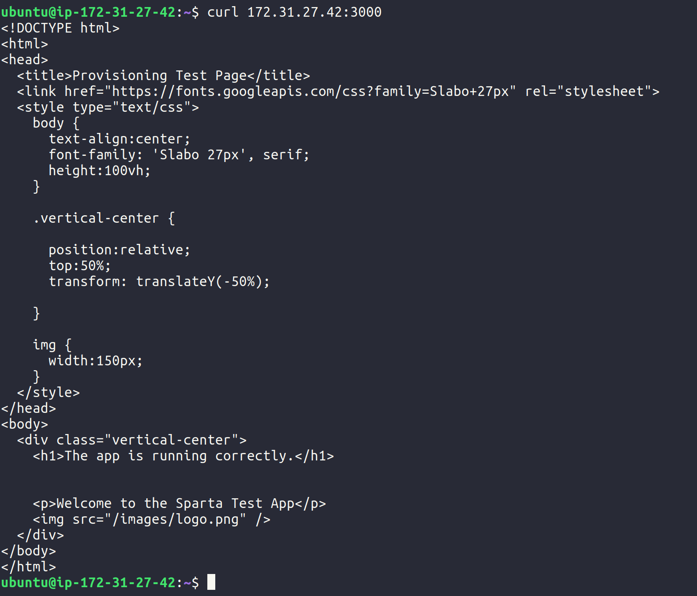

# AWS and Deployment

## What is cloud

"The cloud" refers to servers that are accessed over the Internet, and the software and databases that run on those servers. Cloud servers are located in data centers all over the world. By using cloud computing, users and companies don't have to manage physical servers themselves or run software applications on their own machines.
</br>

[source](https://www.cloudflare.com/learning/cloud/what-is-the-cloud/)

## What is AWS

Amazon Web Services (AWS) is the world’s most comprehensive and broadly adopted cloud platform, offering over 175 fully featured services from data centers globally. Millions of customers—including the fastest-growing startups, largest enterprises, and leading government agencies—are using AWS to lower costs, become more agile, and innovate faster.
</br>

[source](https://aws.amazon.com/what-is-aws/)

## What is EC2

Amazon Elastic Compute Cloud (Amazon EC2) is a web service that provides secure, resizable compute capacity in the cloud. It is designed to make web-scale cloud computing easier for developers. Amazon EC2’s simple web service interface allows you to obtain and configure capacity with minimal friction. It provides you with complete control of your computing resources and lets you run on Amazon’s proven computing environment.
</br>

[source](https://aws.amazon.com/ec2/?ec2-whats-new.sort-by=item.additionalFields.postDateTime&ec2-whats-new.sort-order=desc)

## What is SG

AWS security groups (SGs) are associated with EC2 instances and provide security at the protocol and port access level. Each security group — working much the same way as a firewall — contains a set of rules that filter traffic coming into and out of an EC2 instance. Unlike network access control lists (NACLs), there are no “Deny” rules. If there is no rule that explicitly permits a particular data packet, it will be dropped.
</br>

[source](https://cloudacademy.com/blog/aws-security-groups-instance-level-security/#:~:text=AWS%20security%20groups%20(SGs)%20are,out%20of%20an%20EC2%20instance.)

## Port 22

Port 22 allows for SSH access. SSH allows the user to connect to the server therefore allowing them unauthorized access to the files on the server. Allowing only specific IP addresses through the firewall for SSH ensures that the network remains secure from any breaches.

## SSH Key

SSH key is stored in ~/.ssh/ folder.

## How to ssh

`ssh <option> <username>:<ip_addr>`

## How to send a file

```bash
#!/bin/sh

# rsync (LINUX)
commands.txt
rsync <file> <username>@<ip_addr>:<location>

# scp (WINDOWS + LINUX)
scp <file> <username>@<ip_addr>:<location>
```

## Multiple files


```bash
#!/bin/sh

# rsync (LINUX)
commands.txt
rsync -a <folder> <username>@<ip_addr>:<location>

# scp (WINDOWS + LINUX)
scp -r <folder> <username>@<ip_addr>:<location>
```

## APP.JS

We can copy our project files from our previous project (NodeJS Task) and customise some of provion.sh shell commands. For example:

```bash
#!/bin/bash

# Update the sources list
sudo apt-get update -y

# upgrade any packages available
sudo apt-get upgrade -y

# install git
sudo apt-get install git -y

# install nodejs
sudo apt-get install python-software-properties -y
curl -sL https://deb.nodesource.com/setup_12.x | sudo -E bash -
sudo apt-get install nodejs -y

# install pm2
sudo npm install pm2 -g

sudo apt-get install nginx -y

sudo cp ~/NodeJS-Task/config_files/nginx.conf /etc/nginx/

# finally, restart the nginx service so the new config takes hold
sudo service nginx restart

cd ~/NodeJS-Task/app/

# npm install

pm2 start app.js
```

We also need to change our nginx.conf file that is provided in the NodeJS-Task repo as this server has a different IP address to the one from our local project. We also cannot assign a hostname link as this server is only accessible via Public IP, therefore the `server_name` will return a non-existant website. This way we can access the website on the IP address `54.195.134.90` and automatically get redirected onto the port `3000`. As the default port for accessing HTTP websites is `80` the nginx config will take care of redirection.

```conf
server {
    listen 80;
    server_name 54.195.134.90;

    location / {
        proxy_pass http://54.195.134.90:3000;
    }
}
```

## Picture app running on port 80 and 3000

Port 3000:


Port 80:


## Testing if app on private IP:3000

```bash
curl <private_ip>:3000
```

## Copying Files onto AWS Server

In order to copy files onto the AWS Server we need to establish a connection with the `.pem` file provided when initialising the server. Therefore in order to create the connection again and copy the files over we need to ensure that this `.pem` file is provided as an argument. In scp (secure copy) we can pass the `.pem` file as an argument of option `-i` and through the absolute path of `~/.ssh/<key>.pem` we are able to create a connection. Similarly in rsync we can pass an argument `-e` but in this case we establish the SSH connection as an argument. In order to copy a folder just like with the regular `cp` function we can use the argument `-r` in order to recursively copy the folder and all the files contained within it. If possible use `rsync` as it is a much faster way of copying files onto a remote machine.

```bash
#!/bin/sh

# rsync (LINUX)
rsync -e "ssh -i ~/.ssh/eng74hubertawskey.pem" -a <folder>/ ubuntu@54.195.134.90:<folder>/

# scp (WINDOWS + LINUX)
scp -i ~/.ssh/eng74hubertawskey.pem -r <folder>/ ubuntu@54.195.134.90:<folder>/
```

## Private IP at port 3000


