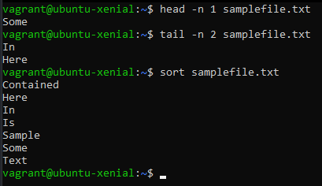
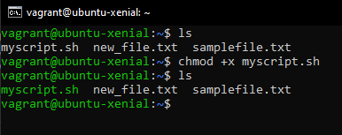
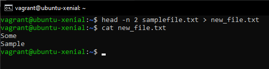

# Bash-Task

## Head Tail Sort

- Head prints the first 10 lines out of the file by default
  - `head <filename>`
- With the addition of `-n` flag we can specify how many lines we would like to see
  - `head -n 2 <filename>`
- Tail works the same way as head but instead prints the bottom lines of the file
  - `tail <filename>`
  - `tail -n 2 <filename>`
- Sort is used to alphabetically or numerically sort the content by each line.
  - `sort <filename>`

## Permissions

- To change file permissions we use the `chmod` command followed by the permission level and file we would like to edit.
- `chmod 666 example_file.txt`

| Value | Meaning                                                                                          |
| ----- | ------------------------------------------------------------------------------------------------ |
| 777   | No restrictions, anyone can do anything. Not advised.                                            |
| 755   | The file's owner may read, write and execute the file. All others may read and execute the file. |
| 700   | The file's owner may read, write and execute the file. Nobody else has any rights.               |
| 666   | All users may read and write the file                                                            |
| 644   | The owner may read and write a file while all others may only read the file                      |
| 600   | The owner may read and write a file, all others have no rights                                   |

- You can also change permissions using flag names.
- For example: `chmod +x <filename>`
- Adding `+x` will make the file executable
- Otherflags available:
  - `+r` gives read rights
  - `+w` gives write rights

## Streams

There are 3 types of streams in bash. Standard Output, Error and Input stream. These streams are used to receive and send sequences of characters into and out of bash.

- `stdout` a *standard output stream* which displays output from commands.
- `stderr` a *standard error stream* which displays error output from commands.
- `strdin` a *standard input stream* which provides input to commands.

## Redirects

Redirection is used to send and redirect the output of one command to another command / file etc.

- `n>` this redirect the output from file n to another file or command.
- If the file does not exist it is created.
- If it does exists it's content is overriden and no warning is given.

