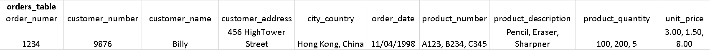
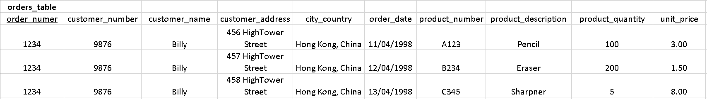
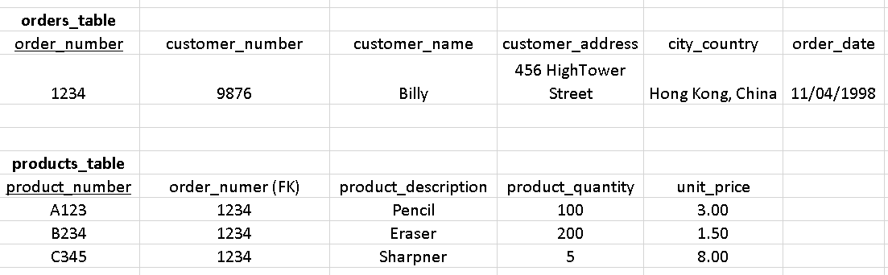
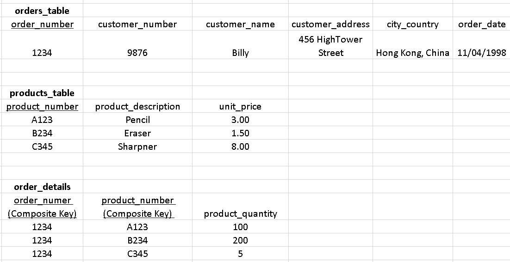
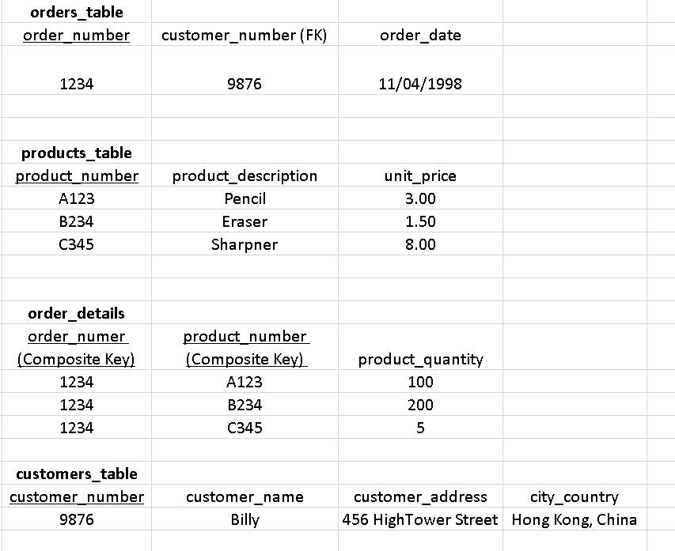
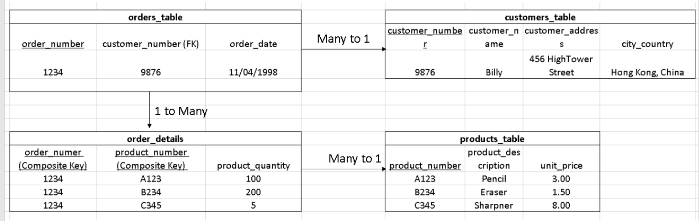

# Answers and Explanations to Theory Questions

## QUESTION 1:


This is known as unnormalised form (UNF), there is duplication and non-key dependancies (in fact there is no clearly defined primary key yet). If you wanted the customer name for this order, you would need to load all kinds of information about the type and number of products they ordered, which is unnecessary.

city_country is not great, but it is *technically* okay because 'Hong Kong, China' is one string, so one input, so when going to 1st Normal Form I will leave it. Remember we can't call this 'location' because of SQL issues.

## QUESTION 2:

Making the data 'Atomic' and defining a primary key:



But there is another complexity.
The rules to satisfy the 1st normal form are:
```
- When the data is in a database table.  The table stores information in rows and columns where one or more columns, called the primary key, uniquely identify each row.

- Each column contains atomic values, and should be not repeating groups of columns.
```
[Source](https://www.essentialsql.com/get-ready-to-learn-sql-8-database-first-normal-form-explained-in-simple-english/#:~:text=Tables%20cannot%20contain%20sub%2Dcolumns,values%20cannot%20be%20further%20subdivided.)


So even though I have defined one primary key 'order_number' it does not uniquely identify the rows, and therefore this table *is not* in 1st Normal Form. Furthermore, there is a lot of duplication (e.g i have to list the order number and customer name a lot) I could, in this case, use 'product_number|description|quantity' as a primary key to identify the rows, but this is a very unsustainable solution that would fall apart quickly if another customer ordered the same product, it also doesn't eliminate our duplication problem.

__This indicates to me that I need to split my table__:



### __Why did I choose orders and products as my catagories, why not customers?__

My candidates for the second primary key were

A) order_number

B) customer_number

C) product_number

We know products has to be a winner because I can't use either of the others as keys to uniquely identify the rows if product number is in that table.

If we use customer_number, it would uniquely identify rows of our second table (which would have columns 'customer_number, name, city, address, orders). However, customer_number is dependant on order_number, but order_number is not dependant on customer_number.

In other words: if i change customer_number i must change the order number because an order can only belong to one customer, whereas if i changed order_number, it doesn't necessarily change customer number, because the new order number *could* belong to the same customer.

This dependancy makes order_number the better candidate for a primary key than customer_number.

__But product_number does not uniquely identify order_number, so why it this okay?__

Because it uniquely identifies *the row*. Of course this would be a problem *later* if more orders are added, which is why we will fix it soon.

### QUESTION 3:
Right now everything in the orders table is functionally dependent on 'order_id', meaning if i change anything it leads to a change in order ID. This table is already in 2nd Normal Form.

However, in the products table changing order_number or product_quantity doesn't necessarily lead to a change in order_number.



### QUESTION 4:
```
A transitive dependency in a database is an indirect relationship between values in the same table that causes a functional dependency. To achieve the normalization standard of Third Normal Form (3NF), you must eliminate any transitive dependency.
```
[source](https://www.lifewire.com/transitive-dependency-1019760#:~:text=A%20transitive%20dependency%20in%20a,must%20eliminate%20any%20transitive%20dependency.)

### QUESTION 5:
In other words, for a database to be in 3rd Normal Form, everything in a table must be dependent *ONLY* on the primary key.

Looking at the products_table and order_detils, everything in those tables is dependent *only* on the primary key, so these tables are in 3rd Normal Form. In the orders table: customer name, address and country are dependent on customer_number as well as the primary key, order_numer. This known as a non-key dependency and must be eliminated at this stage.

__Splitting the table again yields:__


To summarise, for a table to be in 3rd Normal form:
1.  A)It must be atomic : every box has onnly 1 entry, note this entry can be a string with a space in the middle.

    B) The primary key must uniquely identify the rows of the table

2. Everything in the table must depend on the primary key
3. Everything in the table must depend *only* on the primary key, no non-key dependencies.

## QUESTION 6:

(Sorry I will post my answers for this later, it would take me too much time right now.)


## QUESTION 7:


Here the order_details table is a *linking_table*. Without this linking table, the relationship between order_table and products_table would be Many to Many which is very undesirable!

[Source](https://fmhelp.filemaker.com/help/18/fmp/en/index.html#page/FMP_Help/many-to-many-relationships.html)

Even though we didn't intentionally set out to remove many-to-many relationships, we ended up doing so by following the rules and stages of Normalisation, and created a linking table. This is by design. Eliminating many-to-many relationships removes duplication and the need for artificial rules.

## QUESTION 8: False

Null is not '=' to anything. It is the absence of data whereas 0 is a value. You can do mathematical operations with 0 (except devide obviously) but you cannot do that with Null.

Be careful to use IS or IS NOT when you want to 'equate' things to NULL and be aware that you can't 'DROP' *fields* so if you want to delete a field you need to 'UPDATE' it to NULL.

## QUESTION 9: 2

The purpose of this question was to clarify thhe difference between the *columns* and *rows* (data) which shows up in the JOIN output.

```sql
SELECT columns_you_want
FROM table1
INNER JOIN table2 ON ...
```

The type of join determines the data which comes up.

## QUESTION 10: 1,2,3 and 4 (Trick Question)
The question didn't specify whether we are aliasing *tables* or *columns*, so if we're talking about aliasing in general, you can always alias (but this doesn't mean you should!).

Tables already exist (they were created when  making the database) so you can always alias them as long as you define the alias somewhere in your query.

Aliasing columns is not always possible because the server doesn't process your query in the same order that you write it (see image below)


For example:

You can't call an aliased column in your 'GROUP BY' function because it only exists after the SELECT clause has been executed, which happens *after* GROUP BY is executed. However, you can always call an aliased *table* because the FROM statement is executed first.

Using this order of execution, we can see that the only times when you can call an aliased *column* is in the ORDER BY or LIMIT clauses.


## QUESTION 11: 3

Similar to Question 9: The select part determines which *columns* come up and the type of join determines which *data* comes up.

- we have SELECT *
    - so all columns come up

- and LEFT JOIN
    - so data from the left table

We didn't specify OUTER JOIN (see image below), therefore this LEFT JOIN would also display data from the right table where the tables intersect.


