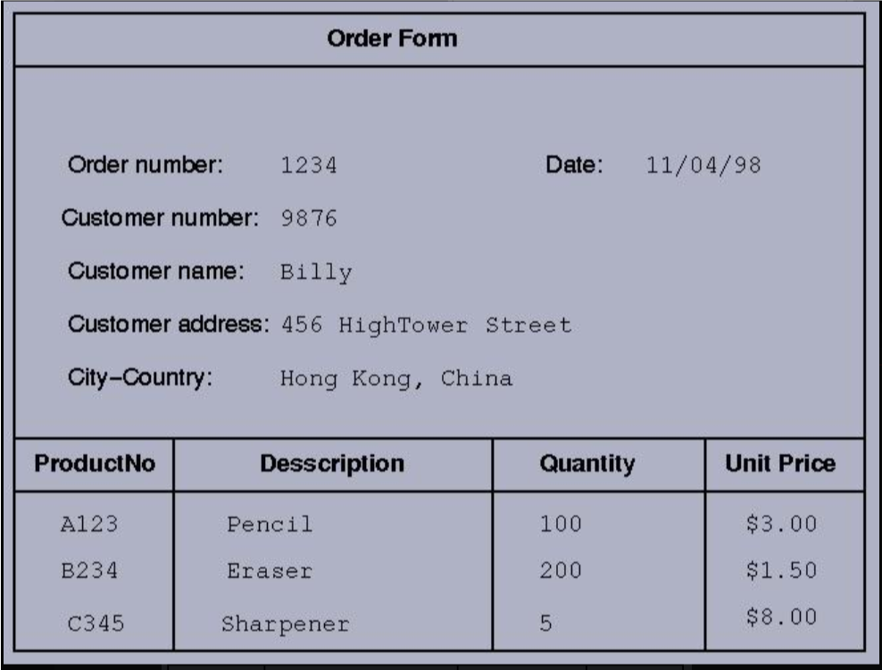

# D3v & Farah Revision Session

## Theory

### Part A: Normalisation other Useful Info

We are going to get this information into a 3rd Normal form:



Remember: When in doubt, make more tables! The whole point of normalisation is to simplify your database, so you don't keep loading information that you don't need.

### QUESTION 1. Create a simple list of all the column headings you think you will need from the 'Order Form' attached above, then fill out the table below with those + the information. For now, it's okay that a box has multiple entries seperated by a colon

__TIP__: the number of columns in the template is correct. Remember to use proper naming conventions for the column headings!

Template:
|  column1  | column2    | column3  | column4  | column5  | column6  | column7  |  column8 | column9  | column10  |
|---|---|---|---|---|---|---|---|---|---|
|  A | B  | C  | D  | E  | F  | G  | H  | I  | J  |

### QUESTION 2. Put the above table into 1st Normalised Form. - Intermediate

```md
Each table cell should contain a single value.
Each record needs to be unique.
```

__TIP__: 1st Normal Form doesn't necessarily mean only one table.

### QUESTION 3. Put your table into 2nd Normalised Form. -- Hard

__TIP__ 'customers' isn't always the right choice for a table heading. Consider other possibilities.

```ms
A relation is in second normal form if it is in 1NF and every non key attribute is fully functionally dependent on the primary key.

In English:
Everything in a table must be relevant to the table's primary key.
```

### QUESTION 4. What is the difference between 2nd and 3rd Normal Form? -- Intermediate

__TIP__ What does 'transistive dependency' mean?

### QUESTION 5. Normalise your database to the 3rd Normal Form. -- Hard

__TIP__: Ask yourself 'if I change A, does B change?' if yes, then B is *dependent* on A.

### QUESTION 6. (Optional) Build this database! Take a screenshot of all your tables. Did you have to clean up / fix anything? -- Hard

### QUESTION 7. Label the relationships between your tables as 1 to 1, 1 to Many, Many to 1, or Many to Many. Why are Many to Many relationships undesirable and what can we do to eliminate them? -- Intermediate

__Tip__: When in doubt.. ?

### Part B - Joins and Other Useful Info

__TIP__: Feel free to test out things in azure to find the answers.

### QUESTION 8. Is the following statement True or False: NULL = 0? -- Easy

### QUESTION 9. Which of the following outputs would result from an SELECT * INNER JOIN statement? -- Easy

1. all columns of both tables showing all data, NULL where there is no intersection

2. all columns of both tables showing only data where the tables intersect

3. all colums of the first table showing all data, regardless of intersection with the second table

4. None of the above

### QUESTION 10. An alias can be *called* within: -- Intermediate

1. CASE
2. SELECT
3. ORDER BY
4. GROUP BY
5. WHERE
6. None of the above

### QUESTION 11. Which of the following outputs would result from a SELECT * LEFT JOIN statement? -- Very Hard

1. all columns of both tables showing only data where the tables intersect

2. all columns of the left table showing only data where the tables intersect

3. all columns of both tables showing all data in the left table and only data from the right table where the tables intersect

4. None of the above
